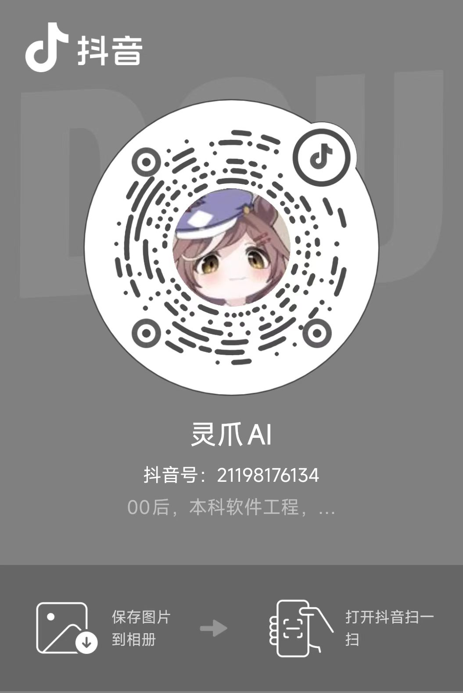
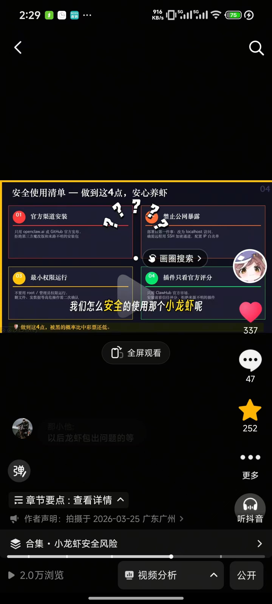
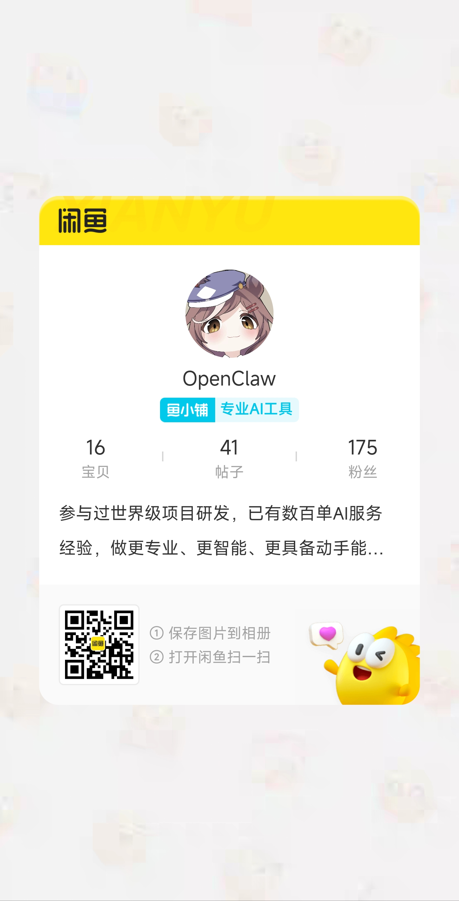
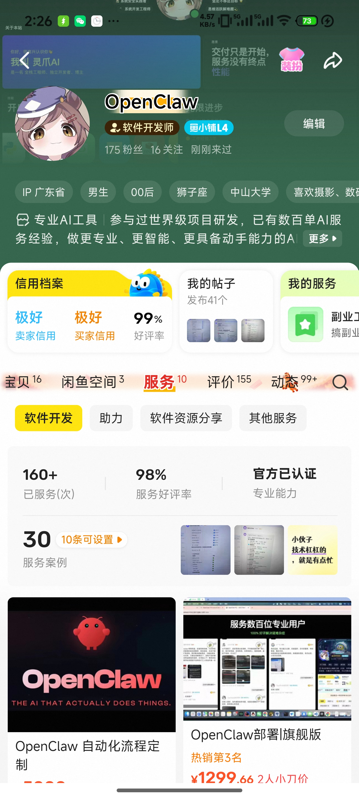

# Omni-Ecom OS
## 基于多 Agent 协作的"全链路无人化"电商经营系统

---

## 📸 项目截图

### 抖音自媒体运营



### 闲鱼店铺运营



---

### 项目愿景

OPC智能体控制中心是Omni-Ecom OS的核心控制台，旨在打造超级个体的全链路智能协作生态。通过多Agent总线式协作，实现从选品、财务、推广、运营、客服、交付到技术维护的全流程自动化闭环。

---

## 1. 项目解决的核心痛点

### 1.1 决策孤岛
- 选品 Agent 不知道财务预算
- 推广 Agent 不理解技术限制
- 各环节无法自动闭环，导致协作断层

### 1.2 长链路逻辑丢失
- 从"选品"到"售后交付"的流程往往跨越数周
- 普通 AI 无法维持长达数十万 Token 的业务上下文
- 跨阶段决策逻辑容易丢失

### 1.3 交付与技术断层
- 非技术用户无法将选品逻辑转化为自动化交付工具
- 业务规模化困难，重复性工作繁重
- 技术与业务部门沟通成本高

---

## 2. 核心架构

### 2.1 技术底座
- **OpenClaw (小龙虾)**：轻量级 Agent 编排框架
- **MiMo-V2.5**：多模态大语言模型，支持深度推理
- **长链推理 (Long-Chain Reasoning)**：跨 Agent 深度上下文回溯技术

### 2.2 七大核心智能体集群

#### 🧠 决策层
1. **选品 Agent**
   - 抓取全网热点（TikTok/Red）
   - 竞品分析与市场调研
   - 输出：潜力爆品清单

2. **财务 Agent**
   - 实时汇率监控
   - 物流成本计算
   - ROI 预测（基于294+历史案例）
   - 盈利模型推理

#### 🚀 流量层
3. **推广 Agent**
   - 自动调用 ComfyUI 生成营销素材
   - 多平台内容分发
   - 投放效果追踪与优化

4. **运营 Agent**
   - 全平台运营自动化（抖音/闲鱼/飞书）
   - 活动策划与执行
   - 用户增长策略

#### ⚡ 执行层
5. **客服 Agent**
   - 1M 级私域知识库检索
   - 深度说服与转化
   - 7x24 智能应答

6. **交付 Agent**
   - 自动部署 OpenClaw 镜像
   - 软件序列号自动生成
   - 订单交付全流程跟踪

#### 🔧 支撑层
7. **技术 Agent**
   - 系统健康巡检
   - 接口失效自动修复
   - 鉴权异常处理
   - 7x24 持续运行保障

---

## 3. 核心技术亮点

### 3.1 总线式协作架构
各 Agent 通过消息总线进行通信，实现：
- 松耦合集成
- 动态编排
- 弹性扩展
- 容错降级

### 3.2 长链推理 (Long-Chain Reasoning)
当客服 Agent 遇到刁钻问题时，系统会：
1. 溯源至选品 Agent 最初的调研记录
2. 调取财务 Agent 的 ROI 分析
3. 关联技术 Agent 的配置文档
4. 综合所有上下文进行深度推理

这种跨 Agent 的深度上下文回溯是支撑高额度 Token 的技术支柱。

### 3.3 智能体编排
```
选品决策 → 财务审核 → 素材生成 → 推广分发
    ↓           ↓           ↓           ↓
  溯源查询 ← 盈利预测 ← 效果追踪 ← 运营优化
```

---

## 4. 核心逻辑流

### 4.1 选品与财务闭环
```
选品 Agent 抓取热点
    ↓
财务 Agent ROI 预测
    ↓ (通过盈利模型)
进入推广环节
```

### 4.2 推广与运营闭环
```
基于选品特性
    ↓
ComfyUI 生成营销素材
    ↓
全平台自动化分发
    ↓
效果追踪与优化
```

### 4.3 客服与交付闭环
```
客服 Agent 深度说服
    ↓ (成交)
交付 Agent 自动触发
    ↓
OpenClaw 镜像部署
    ↓
序列号自动生成
```

### 4.4 技术保障闭环
```
技术 Agent 健康巡检
    ↓ (发现问题)
接口/鉴权修复
    ↓
7x24 持续运行
```

---

## 5. 项目结构

```
opc/
├── src/
│   ├── components/          # Vue 组件
│   │   ├── EmployeeCard.vue        # 智能体卡片
│   │   ├── EmployeeDetail.vue      # 智能体详情
│   │   ├── EmployeeForm.vue        # 智能体表单
│   │   ├── EmployeeAvatarUpload.vue # 头像上传
│   │   ├── CategoryFilter.vue       # 分类筛选
│   │   ├── BossProfile.vue         # 管理员档案
│   │   └── SiteConfigForm.vue      # 站点配置
│   ├── data/
│   │   └── employees.js           # 智能体数据
│   ├── services/
│   │   └── api.js                 # API 服务
│   ├── utils/
│   │   └── avatar.js             # 头像工具
│   └── App.vue                   # 主应用
├── public/
└── package.json
```

---

## 6. 技术栈

### 前端
- Vue 3 (Composition API)
- Vite (构建工具)
- Lucide Icons (图标系统)
- CSS3 (渐变、动画、响应式)

### 后端 (规划中)
- Node.js / Express
- PostgreSQL / MongoDB
- Redis (缓存)
- Docker (容器化)

### AI 能力
- OpenClaw (小龙虾)
- MiMo-V2.5
- ComfyUI
- LangChain / LlamaIndex

---

## 7. 发展路线

### Phase 1: 基础框架 ✅
- [x] 智能体管理界面
- [x] 基本 CRUD 功能
- [x] 分类筛选
- [x] 头像上传

### Phase 2: 协作基础
- [ ] Agent 间通信协议
- [ ] 任务编排引擎
- [ ] 上下文管理
- [ ] 日志与追踪

### Phase 3: 智能协作
- [ ] 长链推理引擎
- [ ] ROI 预测模型
- [ ] 自动素材生成
- [ ] 多平台分发

### Phase 4: 全链路闭环
- [ ] 财务审核流
- [ ] 客服知识库
- [ ] 自动交付流
- [ ] 技术巡检

### Phase 5: 规模化运营
- [ ] 多租户支持
- [ ] 数据分析面板
- [ ] API 开放平台
- [ ] 商业化部署

---

## 8. 团队与支持

### 核心团队
- **OPC (超级个体)**：产品设计与运营
- **OpenClaw Team**：Agent 框架支持
- **MiMo Team**：大模型技术支持

### 联系方式
- 项目主页：OPC智能体控制中心
- 技术支持：OpenClaw 社区
- 商业合作：[待定]

---

## 9. 许可证

本项目采用 [待定] 许可证。

---

## 10. 致谢

感谢所有为 Omni-Ecom OS 付出努力的技术团队和社区贡献者。

---

**版权声明**：© 2026 Omni-Ecom OS. 基于 OpenClaw 与 MiMo-V2.5 构建。
